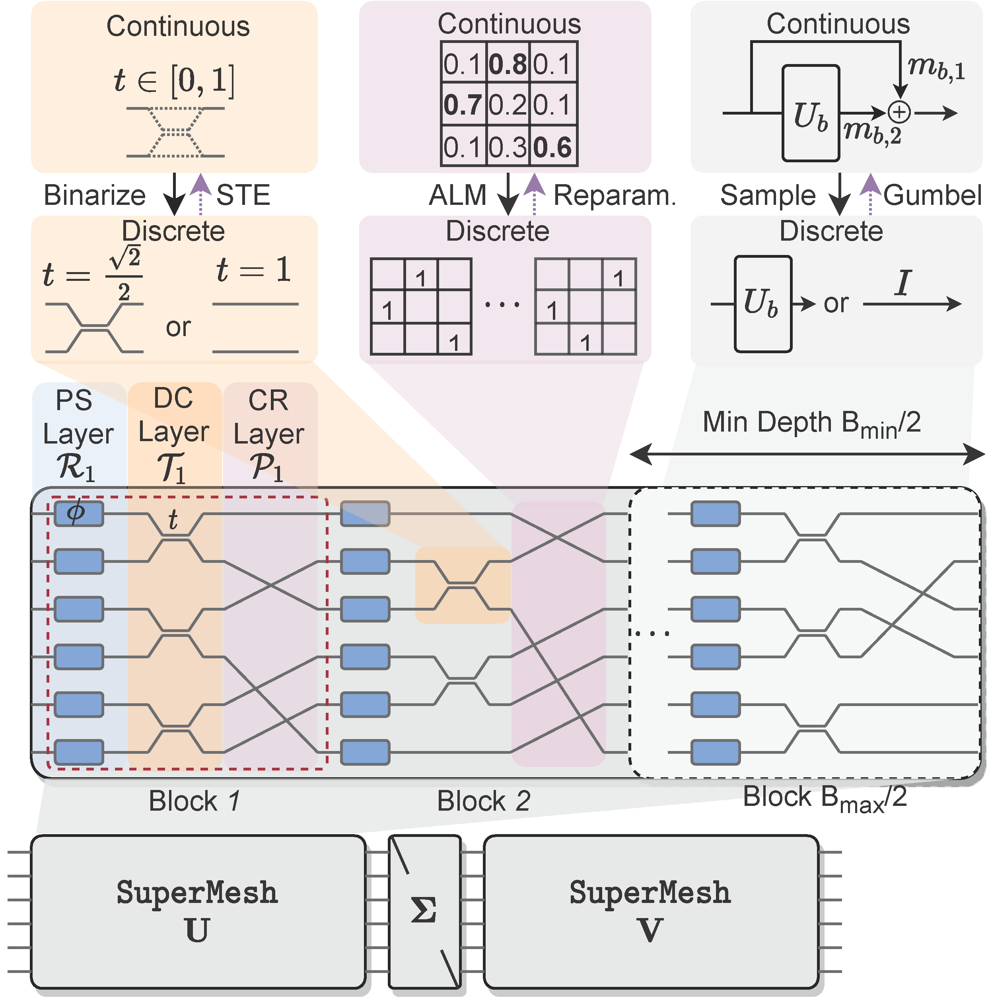
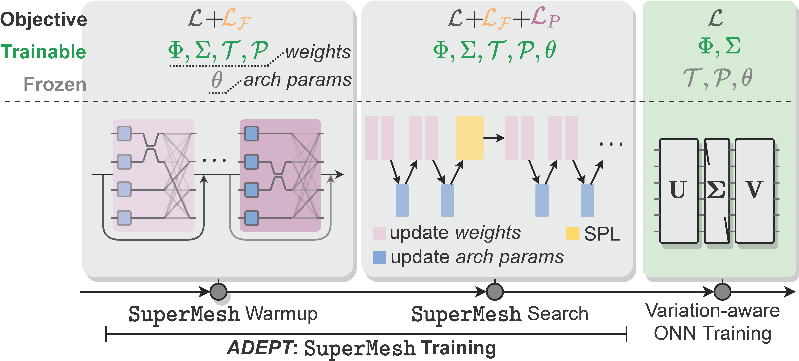
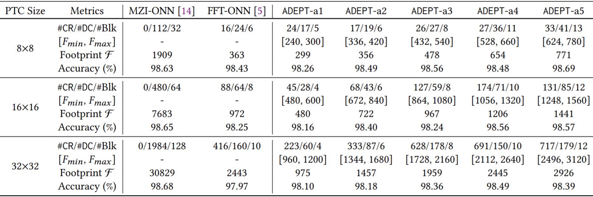

# Automatic Differentiable Design of Photonic Tensor Cores (ADEPT)

By [Jiaqi Gu](https://github.com/JeremieMelo), [Hanqing Zhu](https://github.com/zhuhanqing), [Chenghao Feng](https://github.com/Fengchenghao1996), [Zixuan Jiang](https://github.com/zixuanjiang), Mingjie Liu, Shuhan Zhang, Ray T. Chen and David Z. Pan.

This repo is the official implementation of "[ADEPT: Automatic Differentiable DEsign of Photonic Tensor Cores](https://arxiv.org/abs/2112.08703)".

# Introduction
**ADEPT** is the first fully differentiable framework that can efficiently search photonic tensor core (PTC) designs adaptive to various circuit footprint constraints and foundry PDKs. Extensive experiments show superior flexibility and effectiveness of the proposed **ADEPT** framework to explore a large PTC design space. On various NN models and benchmarks, our searched PTC topology outperforms prior manually-designed structures with competitive matrix representability, 2x-30x higher footprint compactness, and better noise robustness, demonstrating a new paradigm in photonic neural chip design.



To enable PTC topology search in a differentiable way, we introduce probabilistic photonic **SuperMesh** to search the PTC depth, augmented Lagrangian method to learn waveguide connections, and binarization-aware training to learn the coupler placement.
We alternately train **SuperMesh** weights and architectural parameters.


On AMF foundry PDKs with a 2-layer CNN on MNIST, compared to the largest and most expressive MZI-based
PTC, our searched **ADEPT-series** shows competitive learnability in ONN accuracy with **2×-30×** footprint reduction.

# Dependencies
* Python >= 3.6
* pyutils >= 0.0.1. See [pyutils](https://github.com/JeremieMelo/pyutility) for installation.
* pytorch-onn >= 0.0.2. See [pytorch-onn](https://github.com/JeremieMelo/pytorch-onn) for installation.
* Python libraries listed in `requirements.txt`
* NVIDIA GPUs and CUDA >= 10.2

# Structures
* core/
    * models/
        * layers/
            * super_mesh: SuperMesh definition
            * super_linear, super_conv: CONV/Linear based on SuperMesh
            * super_utils, utils, activation: utility functions
        * super_model_base: basic module of Super ONN model
        * cnn, vgg8, lenet5.py: ONN models
    * datasets: contains various dataset definition
    * builder.py: build training utilities
* configs/: YAML-based config files
* scripts/: contains experiment scripts
* unitest/: unitest script for layer/model/functions
* train.py: search PTC topology
* retrain.py: train the searched PTC architecture on other tasks
* test.py: test script for performance evaluation

# Usage
* Search 16x16 PTC topology on MNIST CNN with different area constraints using AMF foundry PDKs.\
`> python3 scripts/mnist/cnn/super_train/train_16.py`

* Retrain searched 16x16 PTC architecture on FMNIST LeNet-5. Need to replace the checkpoint path argument in the script to the checkpoint path of the super mesh.\
`> python3 scripts/fmnist/lenet5/retrain/retrain_16.py`

# Citing Automatic Differentiable Design of Photonic Tensor Cores (ADEPT)
```
@inproceedings{gu2022ADEPT,
  title={ADEPT: Automatic Differentiable DEsign of Photonic Tensor Cores},
  author={Jiaqi Gu and Hanqing Zhu and Chenghao Feng and Zixuan Jiang and Mingjie Liu and Shuhan Zhang and Ray T. Chen and David Z. Pan},
  journal={ACM/IEEE Design Automation Conference (DAC)},
  year={2022}
}
```

# Related Papers
* Jiaqi Gu, Hanqing Zhu, Chenghao Feng, Zixuan Jiang, Mingjie Liu, Shuhan Zhang, Ray T. Chen, David Z. Pan, "ADEPT: Automatic Differentiable DEsign of Photonic Tensor Cores," DAC, 2022. \[[paper](https://arxiv.org/abs/2112.08703)\]
